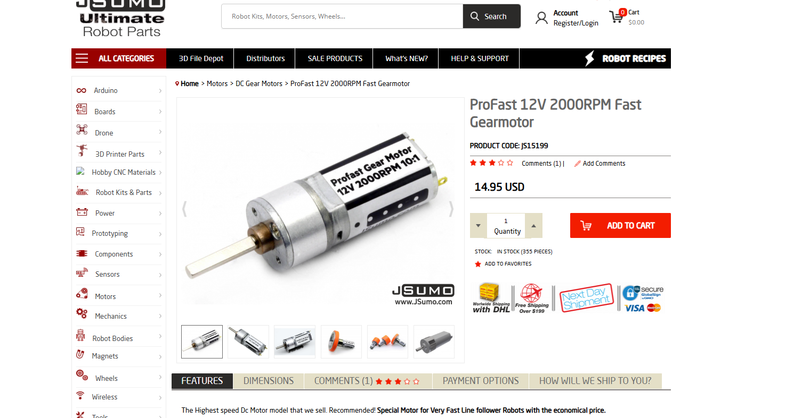
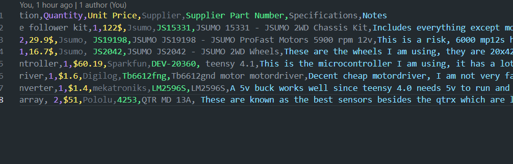
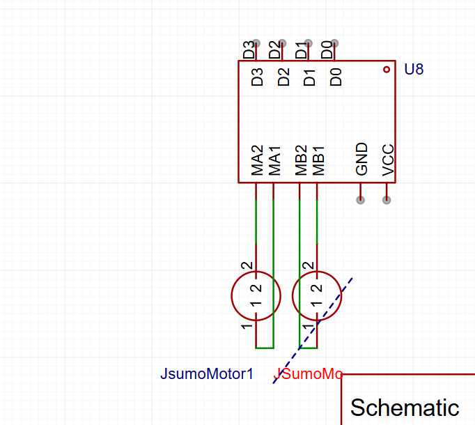
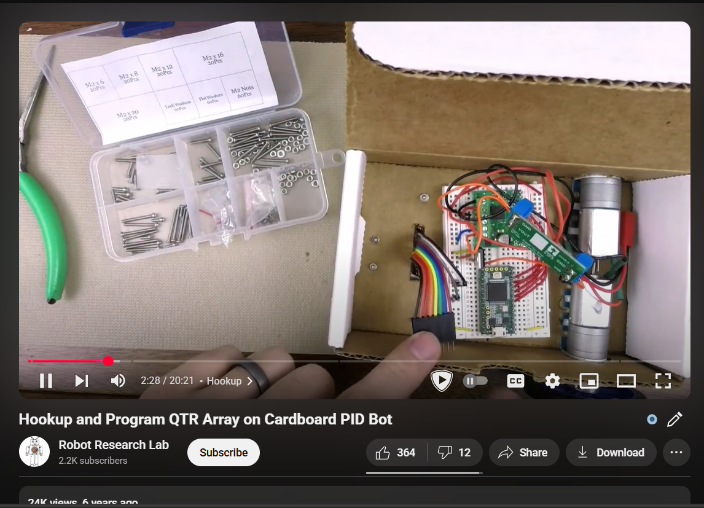
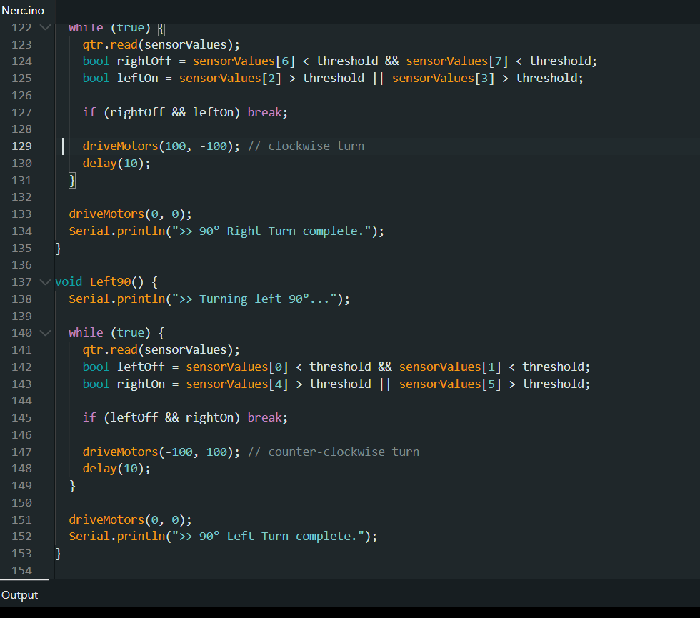
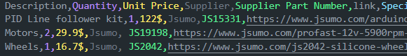

**Total Hours:** 41.15 hours

---

## July 1, 2025 | 4.83 hours

**(9:23pm)** I am right now just looking at all the prices and different things, this is difficult, to make a winning bot in less 350$, shipping is killing my budget, once I see the customs my soul might acu.(I live in pakistan) All things considered, ali express isnt actually cheaper than getting the products directly from their manufacturer. I have been looking at options for like an hour now.Its between QTR 8A and the QTRX 13MD. The motors, i have found really good. I am thinking of getting the jsumo kit. *(worked for 2 hours 30 minutes)*

**(11:53pm)** Ok I think I have a good idea of what I want in my bot-Besides motors Im going to need multiple iterations of jsumo profast motors for that. Going to work on the bom now. *(worked for 2 hours 20 minutes)*

---

## July 2, 2025 | 1.0 hour  

**(12:30pm)** Just finished the BOM.csv and read me I think they will be nice for now. *(worked for 1 hour)*

---

## July 3, 2025 | 6.07 hours

**(2:58pm)** Alright leme cook up a schematic for this thing though it wont use a pcb I think I should still have one. *(worked for 4 hours 4 minutes)*

**(7:02pm)** I should work on the basic chassis now. *(worked for 2 hours)*

**(9:03pm)** chassis is alright, it isnt great (I will add motor mounts to do 3d once I understand the proper code).

---

## July 4, 2025 | 1.0 hour

**(1:01pm)** I forgor how qtr and pid works so Imma watch a video on that. *(worked for 1 hour)*

**(2:23pm)** Alright i am pretty burned out so Ill just relax for a day.

---

## July 6, 2025 | 7.48 hours

**(1:59pm)** Oh mb the journal is supposed to have the time spent written day wise as well. *(worked for 10 minutes)*

**(2:10pm)** I should work on the code now. I'll have to make multiple iterations and take this step by step but it should be easy. *(worked for 1 hour 20 minutes)*

**(3:31pm)** Alright I finished the pid code. Now the nerc track code and the test code is left, those will take some time. *(worked for 29 minutes)*

**(4:00pm)** alright I just checked, digilog has the tb661fng a motordriver much better than a zk5ad,leme update the bom and what not to have that. *(worked for 5 minutes)*

**(6:01pm)** Aftari and prayers are done, Im going to code in arduino IDE for a bit-Actually I just remembered I have to update the schematic for the tb6612fng. *(worked for 25 minutes)*

**(8:05pm)** Alright I finished the PID Test and motors test.ino and also reformated the code for tb6612fnd, zk5ad uses its direction pins as pwm pins, tb5512fng does not, had to learn how everything worked since im not familiar with tb6612fng. *(worked for 2 hours)*

**(10:22pm)** aight time to code for the nerc track. I'll have to code artificial any degree turns and a proper junction counter *(worked for 3 hours)*

---

## July 7, 2025 | 12.47 hours

**(1:32am)** I have done 16 hours of work, I need to do 4 more hours to even begin qualifing for tier 3, so I think if I spend a bit more like 50$ more I can get a qtrx 14a which should be complex enough for me to take 4hours+ to refactor and understand it. Also due it being so advanced I think it should take me longer to do things with it, like soldering it.Imma do that once I finish refactoring this journal.
*(worked for 18 minutes)*

**(1:50am)** Alright, qtrx seems a bit difficult but i think it can work, seems a bit difficult.
*(worked on it for 1hour 42 minutes)*

**(1:32pm)** I just woke up, lets see what I should do, hmm it seems a teensy 4.1 would work best with the qtr md 13a. the qtrx is just 2x more expensive for a minor improvement, leme check how the pice changes with qtr and teensy 4.1. Also im going to do some research on other things I could improve.
*(worked for 1 hour 14 minutes)*

**(2:46pm)** I looked at some stm32 stuff, and tallyed and updated the price in the qtr, seems like its just under budget, which is good cause Im going to need the budget for some other stuff like 3d printing the mounts to my chassis, a friend of mine in pakistan is doing printing legion so on that end i should be ok. Im still worried about customs, but lets see maybe they dont charge customs on simple robotics parts. Im going to go update the schematic and code now.*(worked for 1 hour 3 minutes)*

**(3:49pm)** Schematic is done, It took a while to make the custom components for the teensy 4.1, qtr md 13a and have them look good. Now, just the code is left. Oh yeah let me add the images for each day again. *(worked for 16 minutes)*

**(4:05pm)** Also I forogor to add links to my bom leme do that too. *(worked for 1 hour 16 minutes)*

**(5:21pm)** Alr, the code is done and updated. *(worked for 1 hour 7 minutes)*

**(6:28pm)** Time to work on the 3d model ig. *(worked for 5 hours 12 minutes)*

**(11:40pm)** Chassis is done. So is the motor mount. My project is basically done. Now I just have to make the final picture for my project *(worked for 20 minutes)*

## July 8, 2025 | 8.3 hours

**(12:00am)** Aight the full project in 3d is basically done *(worked for 2 hours 14 minutes)*
**(2:14am)** I'll find a decent battery besides that Ill just brush up my read me and I think we are good to go.
**(2:02pm)** Leme just fix up the chassis and readme *(worked for 45 minutes)*
**(5:30pm)** I should get a faq sections checking is a lot easier on them. *(worked for 5 minutes)*
**(6:03pm)** I'll do some revision over the whole project do some things. *(worked for an hour)*
**(7:10pm)** Hmm I need 4 more hours. I think explaining my code and revising it a bit should help. *(worked for 3 hours)*
**(10:09pm)** I added a nice long explaination behind the code for the lfr.
**(10:35pm)** You Know what? The wiring sucks, Imma do I all over again. (worked for 1 hour 14 minutes)
**(11:49pm)** Actually nvm, the old wiring looks better.

### July 10,2025 | 5 minutes

**(6:36pm)** Submitted.
