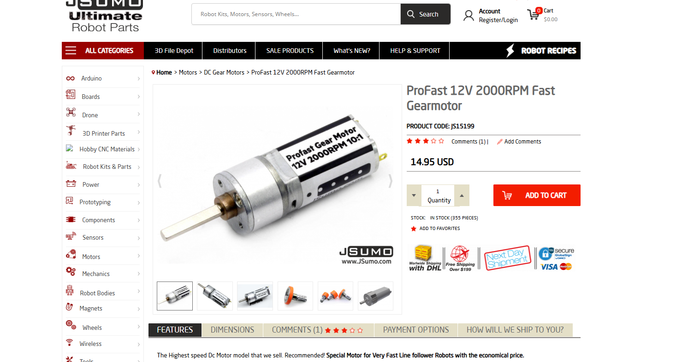
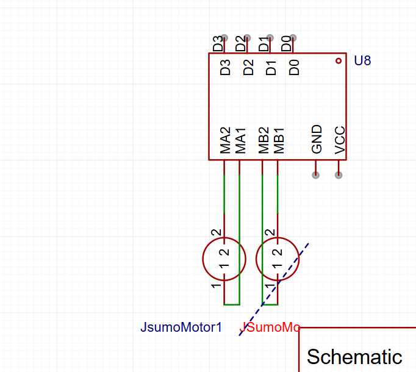

---
(9:23pm/01/july/2025
I am right now just looking at all the prices and different things, this is difficult, to make a winning bot in less 350$, shipping is killing my budget, once I see the customs my soul might acu.(I live in pakistan) All things considered, ali express isnt actually cheaper than getting the products directly from their manufacturer. 
I have been looking at options for like an hour now.Its between QTR 8A and the QTRX 13MD. The motors, i have found really good. I am thinking of getting the jsumo kit.
- Worked on this 3 hours total.
11:53pm/01/july/2025
Ok I think I have a good idea of what I want in my bot-Besides motors Im going to need multiple iterations of jsumo profast motors for that. Going to work on the bom now.
- Worked on this 2 hour total.)- 01/july/2025 worked for 5 hours total.

(12:30am/02/july/2025
Just finished the BOM.csv and read me I think they will be nice for now.
-worked on it for 1 hour total.) - 02/july/2025 worked for 1 hour total.
2:58pm/03/july/2025
Alright leme cook up a schematic for this thing though it wont use a pcb I think I should still have one.
-Worked on it for 4 hours
(7:02pm/03/july/2025
I should work on the basic chassis now.
-Worked on it for 2 hour
9:03pm/03/july/2025
chassis is alright, it isnt great (I will add motor mounts to do 3d once I understand the proper code).)- 03/july/2024 worked for 6 hours total

(1:01pm/04/july/2025
I forgor how qtr and pid works so Imma watch a video on that.
-Worked on it for an hour. 
2:23/04/july/2025
Alright i am pretty burned out so Ill just relax for a day.) - 04/july/2025 worked for 1 hour total.

3:59pm/06/july/2025
Oh mb the journal is supposed to have the time spent written day wise as well.
-worked on it for 10 minutes
4:10pm/06/july/2025
I should work on the code now. I'll  have to make multiple iterations and take this step by step but it should be easy. -worked on it for an hour
5:31pm/06/july/2025
Alright I finished the pid code. Now the nerc track code and the test code is left, those will take some time. -worked on it for 20 minutes
6:00pm alright I just checked, digilog has the tb661fng a motordriver much better than a zk5ad,leme update the bom and what not to have that. - worked on it for 5 minutes.
8:01pm/06/july/2025
Aftari and prayers are done, Im going to code in arduino IDE for a bit-Actually I just remembered I have to update the schematic for the tb6612fng. -worked for 12 minutes
10:05/06/july/2025
Alright I finished the PID Test and motors test.ino and also reformated the code for tb6612fnd, zk5ad uses its direction pins as pwm pins, tb5512fng does not, had to learn how everything worked since im not familiar with tb6612fng. -worked for 2hours.