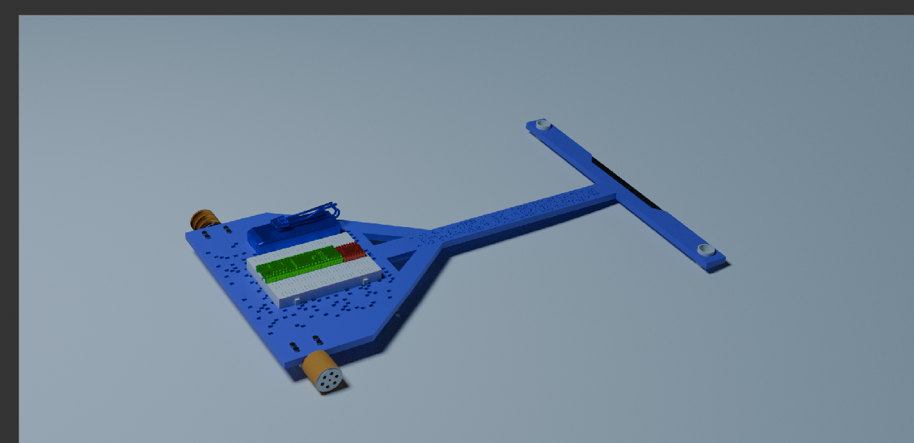
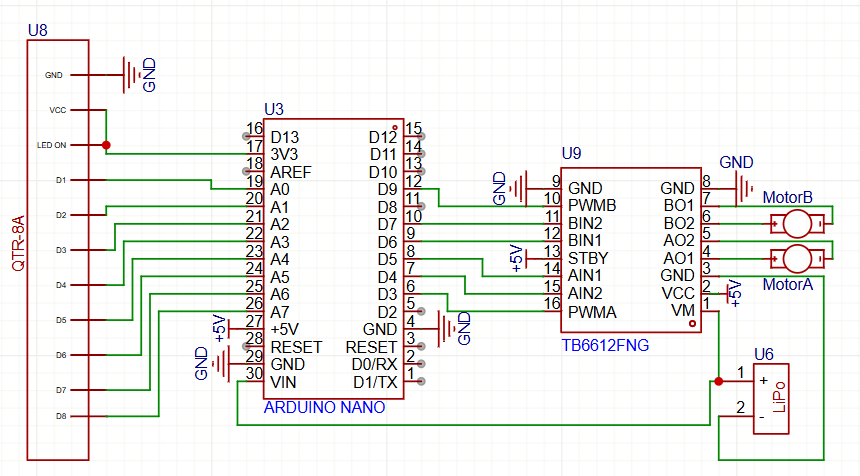
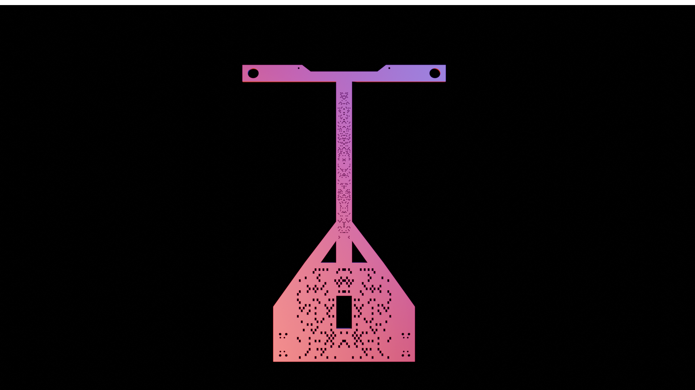
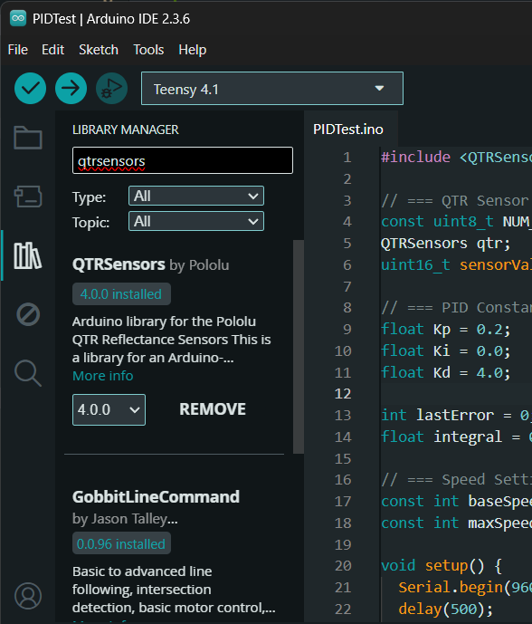
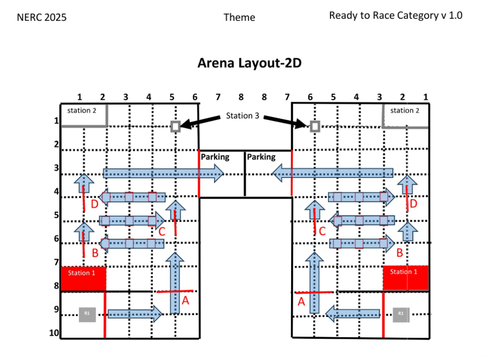

<a id="readme-top"></a>

[![Stars][stars-shield]][stars-url]
[![Issues][issues-shield]][issues-url]

# Redemption


An Advanced PID LFR, that can dance if you want it too.

<!-- TABLE OF CONTENTS -->
<details>
  <summary>Table of Contents</summary>
  <ol>
    <li><a href="#why">Why?</a></li>
    <li>
      <a href="#getting-started">Getting Started</a>
      <ul>
        <li><a href="#specs">Specs</a></li>
        <li><a href="#circuit">Circuit</a></li>
        <li><a href="#chassis">Chassis</a></li>
      </ul>
    </li>
    <li>
      <a href="#code-explanation-and-setup">Code Explanation & Setup</a>
      <ul>
        <li><a href="#setup">Setup Guide</a></li>
        <li><a href="#motorstest">MotorsTest</a></li>
        <li><a href="#pid-test">PID Test</a></li>
        <li><a href="#pid">PID</a></li>
        <li><a href="#nerc">NERC</a></li>
      </ul>
    </li>
    <li><a href="#faq">FAQ</a></li>
    <li><a href="#bill-of-materials-bom">Bill of Materials</a></li>
    <li><a href="#license">License</a></li>
    <li><a href="#contact">Contact</a></li>
  </ol>
</details>

## Why?

Last year I lost the national engineering competition very badly. This time I want to improve, and learn. Also Lfrs are cool asf when they work.
This linefollower will be a comeback inshallah.

<p align="right">(<a href="#readme-top">back to top</a>)</p>

## Getting Started

p.s if you're a reviewer from hackclub I recommend checking out FAQ - it'll save you and me some time.

### Specs

- Microcontroller: Arduino Nano clone
- Motor Driver: Tb6612fng motor driver
- Motor: 3600 rpm jsumo profast motors
- Wheels:High Grip Silicone SLT20 Wheels x2
- Sensors: QTR 8a
- Chassis: 3d printed chassis with premade holes

### Circuit



### Chassis


Just a normal chassis with some holes in it to minimize weight. I haven't completely perfected the dimensions yet, but it works well.

<p align="right">(<a href="#readme-top">back to top</a>)</p>

## Code Explanation & Setup

### Setup

- Order everything in the BOM + a nano or nano clone, QTR 8a, the TB6612FNG motor driver. A large breadboard and an 11v battery, and some basic robotics supplies
- Assemble the kit according to this [assembly guide](https://blog.jsumo.com/arduino-line-follower-robot-assembly-guide/) until the assembly of QTR 8RC part
- Put the nano and TB6612FNG motor driver into the breadboard, use double tape to stick the breadboard and battery to the chassis
- Wire it up as seen in the circuit diagram. I recommend using a buck converter in between the battery and the nano, but most nanos can tolerate 12v so I won't be using any again to save costs
- Download Arduino IDE
- Go to libraries, search QTR sensors and go ahead and install it. Here is a picture if you're confused:
  
- Now [download my repo](https://github.com/licnex/redemption/archive/refs/heads/main.zip)
- Choose which code you want to upload. I recommend first doing motor test to make sure the motors work, then tuning PID with PIDTest, and finally if you have the tracks, doing PID and NERC

> **Note**: None of this code will likely work out of the box - don't expect it to! You will still have to tune things and get some stuff working on your own. Perhaps your motors are inverted, your sensors need a different threshold, pid isn't tuned enough or you mixed up gnd and vcc with the other and fried a component. There are countless things that can go wrong and probably will go wrong, but if you want it to work, you will need to tinker. All I can do is help when you ask - be sure to open an issue when something doesn't work, and I'll be more than happy to debug with you on a call. You should also check out the explanations below and Google stuff or [reach out to me](https://mominkhan.codes) when you don't understand something.

<p align="right">(<a href="#readme-top">back to top</a>)</p>

#### MotorsTest

`void loop()` calls the `motorsTest()` function which takes the speed as an input. The function itself calls other functions that make the bot:

- go forward  
- go backward  
- turn right  
- turn left  
- stop

Each of these is executed with a certain delay in between.

I called `motorsTest()` **twice with different speeds** to ensure that all parts of the motor system are being tested thoroughly. This includes:

- **PWM control** (how well speed can be adjusted),
- **Reverse movement** (checking backward motion),
- **Right and left turning**, and
- **Basic forward driving**.

This ensures that every aspect of the drivetrain — including signal direction, speed modulation, and turning mechanics — works correctly.

---

#### PID Test

This is a **debug function** that prints multiple things to the serial monitor, including:

- Sensor values (there are 8 of them),
- PID corrections.

It can be used to **tune the PID values** or to verify that the sensor readings and control logic are behaving as expected.

> I'm not using calibration here, because it takes up time — and during the competition I’m entering, setup time counts. So I’d rather not rely on calibration to get good readings. Instead, I use raw sensor values and build logic that works reliably without requiring calibration.

---

#### PID

This part of the code does **three things**:

1. **Calculates the robot’s position on the line**, i.e., how centered the sensor array is relative to the line.
2. **Uses the PID algorithm to calculate a correction**, i.e., how much and in what direction the motors should adjust to return to center.
3. **Applies the correction to the motors**.

---

##### Step 1: Position Calculation

This is done using the **QTR Library**, which works with the QTR sensor array. It returns a weighted average of sensor values to determine where the line is under the robot. This gives a single value that represents the position of the line relative to the center of the bot.

---

##### Step 2: PID Correction

The PID algorithm is made up of three components:

- **Proportional (P)**:  
  This is the most important part. It reacts to the current position error — how far off-center the robot is.  
  If the error is large, a stronger correction is applied. If it's small, the correction is smaller.

- **Integral (I)**:  
  This part builds up over time. If the robot has been slightly off for a while, the integral adds up the error and applies a stronger correction to fix it.  
  It’s good for eliminating **steady-state error**.

- **Derivative (D)**:  
  This component looks at **how fast** the error is changing.  
  If the robot is suddenly veering off the line, D will step in to reduce overshoot or oscillation.

These three are combined into a single correction value:

```csharp
correction = Kp * error + Ki * integral + Kd * derivative
```

---

##### Step 3: Applying Correction

The correction value is used to adjust the speeds of the left and right motors:

- If the robot is drifting **left**, we slow the left motor and speed up the right one.
- If it's drifting **right**, we do the opposite.

This is done using **PWM (Pulse Width Modulation)** to finely control the motor speeds.

> Tuning the PID values is key.  
> Too much of one component can cause wobbling, overshooting, or sluggish movement.  
> But when tuned properly, the robot can follow lines quickly and accurately — even around tight curves (though I won’t need that level of tuning for my competition).

---

#### NERC

This can be split into four components:

1. **Line Following**
2. **Junction Detection**
3. **Track Strategy**
4. **Any-Degree Turns**

---

##### 1. Line Following

When there is **no junction or turn** needed to be done, the bot operates as a simple line-following robot using the PID algorithm further explained above.

---

##### 2. Junction Detection

In my testing with the QTR 8a sensor array, I determined that:

So I made a rule:  
> **When 4 or more sensors detect the line simultaneously**, treat it as a junction.

- During this, the robot goes **full speed** and sets a boolean `junctionDetected = true`.
- It keeps reading sensors until the junction ends (i.e., fewer than 4 sensors are on the line).
- At that point:
  - If `junctionDetected` is still `true`, we **increment a counter** and set it back to `false`.

This is a reliable way to detect and count junctions on the fly.

---

##### 3. Track Strategy

  
This is the **track I must follow**.

To do this, I rely on the **junction counter** from above.

When the counter reaches certain values, the bot performs pre-programmed actions:

- At junction 2: turn left
- At junction 4: go straight
- At junction 5: turn right

This lets the bot follow a custom path through the track using only its own sensor input and internal state — no external control or GPS needed.

---

##### 4. Any-Degree Turns

For turning logic:

- If I’m turning **left**, the bot keeps spinning left until:
  - The **sensors 3-4** (left-middle) detect the line,
  - And **none of the sensors 5-8** (right side) detect the line.

This ensures that the turn is **fully completed** and that the bot is properly aligned before continuing.

The same logic is applied symmetrically for **right turns**, using sensors 5-6 (right-middle) and ensuring none of the sensors 1-4 (left side) detect the line.

<p align="right">(<a href="#readme-top">back to top</a>)</p>

---

Integral (I): This keeps track of past errors. If the bot has been slightly off-center for a while, the integral will build up and apply a stronger correction to push it back toward the line. It's useful for small consistent errors.

Derivative (D): This looks at how fast the error is changing. If the bot is veering off quickly, it will apply a counter-correction early to slow it down, helping prevent overshooting and oscillations.

Together, these three components calculate a single correction value. This value is then used to adjust the speeds of the left and right motors. For example, if the bot is drifting to the left, the correction will slow down the left motor and speed up the right one, steering it back to the center of the line.

Finally, this correction is applied to the motors using PWM (Pulse Width Modulation), allowing for fine control over their speed. The result is smooth and responsive line following behavior.

Tuning the PID values (P, I, and D constants) is key—too much of one can cause wobbling or sluggish movement. But when tuned well, the robot can follow lines quickly and accurately, even around sharp turns.(Though I wont need it for that.)

## License

This project is licensed under the MIT License - see the LICENSE file for details

<p align="right">(<a href="#readme-top">back to top</a>)</p>

## FAQ

**Why don't you just use a PCB?**

1. It will take more time to make a PCB then manufacture it compared to using a breadboard and some good ol' wiring.
2. It would significantly increase my budget.
3. Most of these parts are custom components that can't be used in standard PCB manufacturing.
4. The PCB-compatible parts are heavily overpriced.
5. I don't want to.

**Why isn't the battery mentioned in the BOM?**  
I already have a battery from my previous projects that I plan on using. It'll help save the planet and my budget.

**Why did you choose the QTR 8a sensor array?**  
It provides sufficient sensing capability for the track while maintaining a good balance of cost and complexity.

**Why are you doing this?**  
A few months ago I underestimated the difficulty of an LFR and now want to go back to that competition for revenge.

**What are those holes on your chassis?**  
If you mean the ones in the center and neck, those are just there to decrease the weight of the chassis.

**Why do you only have PD implemented out of PID?**  
Ki (Integral) only helps when you have a looped track, which we do not. Using integration would make turning less accurate for our specific course.

**Why aren't the microcontroller and sensor in the budget?**  
Due to the low budget, I will buy them myself.

<p align="right">(<a href="#readme-top">back to top</a>)</p>

## Bill of Materials (BOM)

### Last updated: 2025-07-16

| Description          | Quantity | Unit Price | Supplier | Part Number | Link                                                           | Specifications                        | Notes                                                    |
|----------------------|----------|------------|----------|------------|----------------------------------------------------------------|--------------------------------------|----------------------------------------------------------|
| PID Line follower kit | 1        | $99.07     | Jsumo    | JS15331    | [JSUMO Store](https://www.jsumo.com/arduino-pid-based-line-follower-kit) | JSUMO 15331 - JSUMO 2WD Chassis Kit  | Includes almost everything. Shipping included.            |
| Motors               | 3        | $44.90     | Jsumo    | JS19198    | [JSUMO Store](https://www.jsumo.com/profast-12v-5900rpm-fast-gearmotor) | JSUMO JS19198 - JSUMO ProFast Motors 5900 rpm 12v | High speed motors; I'm using these if I can make the robot light enough so that the lack of torque is manageable. |

**Total Estimated Cost:** $145.00

<p align="right">(<a href="#readme-top">back to top</a>)</p>

<!-- CONTACT -->