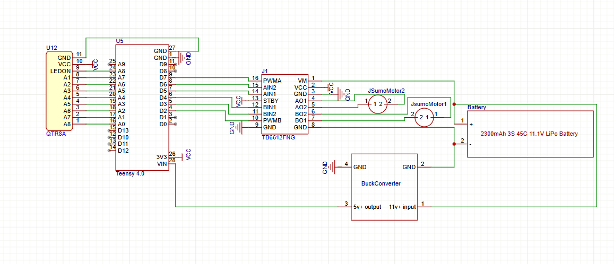

# Redemption
An Advanced PID LFR, that will be programmed to go into the competition NERC 2026 inshallah.
## Getting Started

### Specs

- Microcontroller: Teensy 4.0
- Motor Driver: Tb6612fng motor driver
- Chassis, ball caster, wheels, screws, all the minor things: Jsumo
- Sensors: QTR 8A

### Curcit:

##### Why dont you just use a pcb?
1. it will take more time to make a pcb then manufacture it then to just use a bread board and some good ol' wiring.
2. it will kill my budget.
3. most of these parts are customs components meaning they cant be used in pcb manufacturing.
4. The parts that are supported are heavily over priced.
5. I dont wanna.
### Chassis:

## License

This project is licensed under the MIT License - see the LICENSE file for details

## Bill of Materials (BOM)

| Description | Quantity | Total Price | Supplier | Supplier Part Number | Specifications | Notes |
|-------------|----------|------------|----------|---------------------|----------------|-------|
| PID Line follower kit | 1 | $122.00 | Jsumo | JS15331 | JSUMO 15331 - JSUMO 2WD Chassis Kit | Includes everything except motors wheels motordriver sensors and microcontroller. Also I included the shipping price into this |
| Motors | 2 | $29.90 | Jsumo | JS19198 | JSUMO JS19198 - JSUMO ProFast Motors 5900 rpm 12v | This is a risk. 6000 n20 have a really low torque so getting the kit is reasonable just in case these don't have enough torque. |
| Wheels | 1 | $16.70 | Jsumo | JS2042 | JSUMO JS2042 - JSUMO 2WD Wheels | These are the wheels I am using, they are 20x42mm and are silicone high grip wheels. |
| Microcontroller | 1 | $60.19 | Sparkfun | DEV-20360 | Teensy 4.1 | This is the microcontroller I am using. It has a lot of analog pins and is fast enough to handle the sensors and motors. |
| Motor Driver | 1 | $1.80 | Digilog | Tb6612fng | Tb6612fng motordriver | Decent cheap motordriver. I am not very familiar with it but it seems to work well with the teensy 4.0 and the motors. |
| Buck Converter | 1 | $1.10 | Mekatroniks | LM2596S | LM2596S | A 5v buck works well since teensy 4.0 needs 5v to run and outputs the 3v I need for the sensors. |
| Sensor array | 2 | $51.00 | Pololu | 4253 | QTR MD 13A | These are known as the best sensors besides the qtrx which are like twice the price. Not too familiar with them, and will have to be careful with them since they are quite expensive. |

**Total Estimated Cost:** ~$312.69