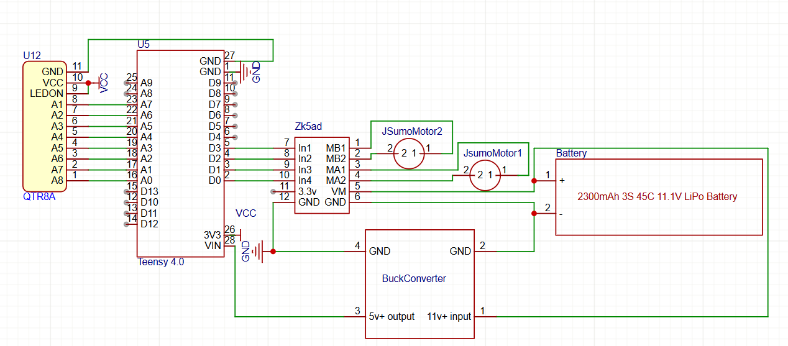
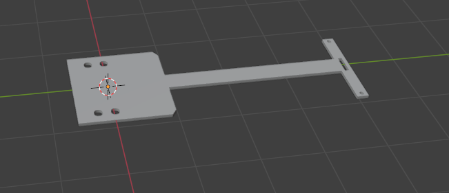

# Redemption

An Advanced PID LFR, that will be programmed to go into the competition NERC 2026 inshallah.
## Getting Started

### Specs

- Microcontroller: Teensy 4.0
- Motor Driver: Drv8871
- Chassis, ball caster, wheels, screws, all the minor things: Jsumo
- Sensors: QTR 8A

### Curcit:

### Chassis:

## License

This project is licensed under the MIT License - see the LICENSE file for details

## Bill of Materials (BOM)

| Description | Quantity | Unit Price | Supplier | Supplier Part Number | Specifications | Notes |
|-------------|----------|------------|----------|---------------------|----------------|-------|
| PID Line follower kit | 1 | $122.00 | Jsumo | JS15331 | JSUMO 15331 - JSUMO 2WD Chassis Kit | Includes everything im going to use except motors wheels motordriver sensors and microcontroller. Also I included the shipping price into this.|
| Motors | 2 | $29.90 | Jsumo | JS19198 | JSUMO JS19198 - JSUMO ProFast Motors 5900 rpm 12v | This is a risk, 6000 rpm motors have a really low torque so I am also getting the 2000 rpms just in case these don't have enough torque. |
| Motors | 2 | $29.90 | Jsumo | JS19199 | JSUMO JS15199- JSUMO ProFast Motors 2000 rpm 12v | These are the 2000 rpm motors, these have a low rpm so they are there just in case. |
| Wheels | 1 | $16.70 | Jsumo | JS2042 | JSUMO JS2042 - JSUMO 2WD Wheels | These are the wheels I am using, they are 20x42mm and are silicone high grip wheels. The wheels that come with the kit are mediocre at best. |
| Microcontroller | 1 | $53.59 | Sparkfun | DEV-16997 | Teensy 4.0 | This is the microcontroller I am using, it has a lot of pins and is fast enough to handle the sensors and motors. |
| Motor Driver | 1 | $1.60 | Digilog | Zk5ad | Zk5ad motordriver | Decent cheap motordriver, I am very familiar with it. |
| Buck Converter | 1 | $1.40 | Mekatroniks | LM2596S | LM2596S | A 5v buck works well since teensy 4.0 needs 5v to run and outputs the 3v I need for the sensors. |

**Total Estimated Cost:** ~$285.69