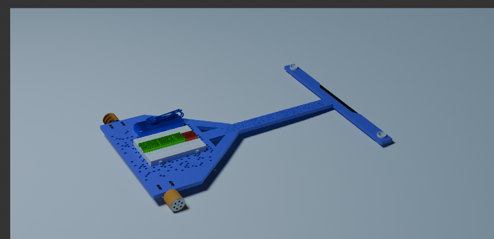
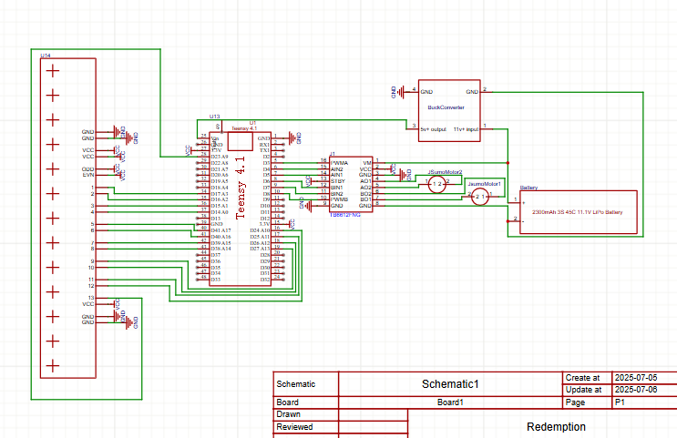
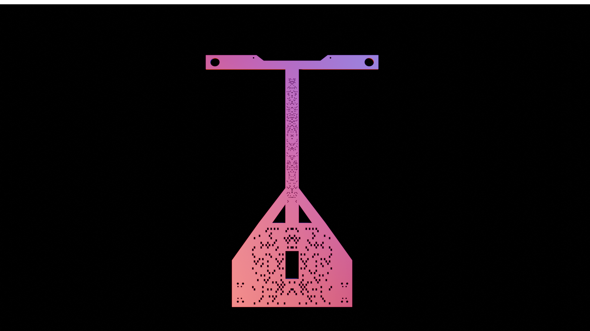
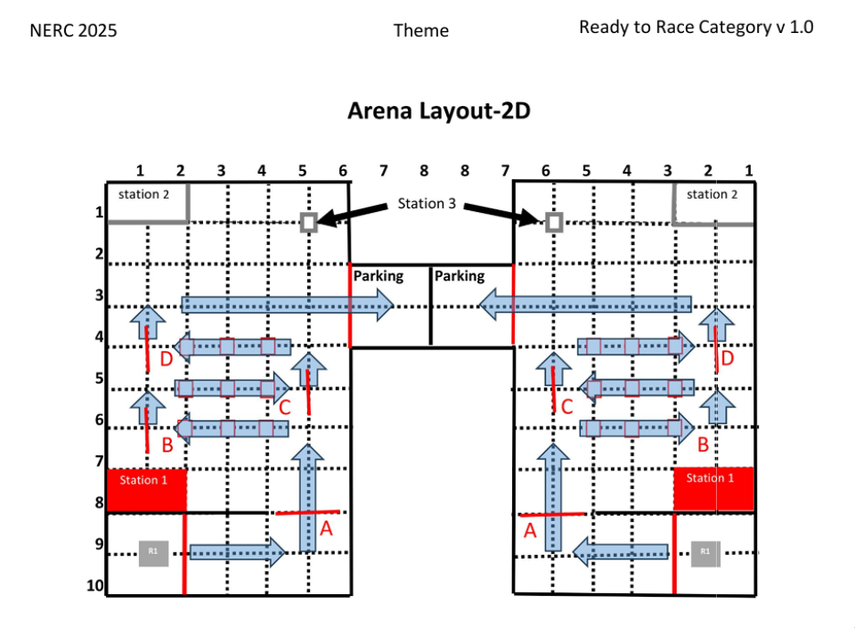

# Redemption


An Advanced PID LFR, that will be programmed to go into the competition NERC 2026 inshallah.

## Getting Started

### Specs

- Microcontroller: Arduino Mega 2560 Pro Mini
- Motor Driver: Tb6612fng motor driver
- Chassis, ball caster, wheels, screws, all the minor things: Jsumo kit
- Sensors: QTR MD 13a

### Curcit



### Chassis



## Code Explaination

#### MotorsTest

`void loop()` calls the `motorsTest()` function which takes the speed as an input. The function itself calls other functions that make the bot:

- go forward  
- go backward  
- turn right  
- turn left  
- stop

Each of these is executed with a certain delay in between.

I called `motorsTest()` **twice with different speeds** to ensure that all parts of the motor system are being tested thoroughly. This includes:

- **PWM control** (how well speed can be adjusted),
- **Reverse movement** (checking backward motion),
- **Right and left turning**, and
- **Basic forward driving**.

This ensures that every aspect of the drivetrain — including signal direction, speed modulation, and turning mechanics — works correctly.

---

### PID Test

This is a **debug function** that prints multiple things to the serial monitor, including:

- Sensor values (there are 13 of them),
- PID corrections.

It can be used to **tune the PID values** or to verify that the sensor readings and control logic are behaving as expected.

> I'm not using calibration here, because it takes up time — and during the competition I’m entering, setup time counts. So I’d rather not rely on calibration to get good readings. Instead, I use raw sensor values and build logic that works reliably without requiring calibration.

---

### PID

This part of the code does **three things**:

1. **Calculates the robot’s position on the line**, i.e., how centered the sensor array is relative to the line.
2. **Uses the PID algorithm to calculate a correction**, i.e., how much and in what direction the motors should adjust to return to center.
3. **Applies the correction to the motors**.

---

#### Step 1: Position Calculation

This is done using the **QTR Library**, which works with the QTR sensor array. It returns a weighted average of sensor values to determine where the line is under the robot. This gives a single value that represents the position of the line relative to the center of the bot.

---

#### Step 2: PID Correction

The PID algorithm is made up of three components:

- **Proportional (P)**:  
  This is the most important part. It reacts to the current position error — how far off-center the robot is.  
  If the error is large, a stronger correction is applied. If it's small, the correction is smaller.

- **Integral (I)**:  
  This part builds up over time. If the robot has been slightly off for a while, the integral adds up the error and applies a stronger correction to fix it.  
  It’s good for eliminating **steady-state error**.

- **Derivative (D)**:  
  This component looks at **how fast** the error is changing.  
  If the robot is suddenly veering off the line, D will step in to reduce overshoot or oscillation.

These three are combined into a single correction value:

```
correction = Kp * error + Ki * integral + Kd * derivative
```

---

#### Step 3: Applying Correction

The correction value is used to adjust the speeds of the left and right motors:

- If the robot is drifting **left**, we slow the left motor and speed up the right one.
- If it's drifting **right**, we do the opposite.

This is done using **PWM (Pulse Width Modulation)** to finely control the motor speeds.

> Tuning the PID values is key.  
> Too much of one component can cause wobbling, overshooting, or sluggish movement.  
> But when tuned properly, the robot can follow lines quickly and accurately — even around tight curves (though I won’t need that level of tuning for my competition).

---

### NERC

This can be split into four components:

1. **Line Following**
2. **Junction Detection**
3. **Track Strategy**
4. **Any-Degree Turns**

---

#### 1. Line Following

When there is **no junction or turn**, the bot operates as a simple line-following robot using the **PID algorithm** described above.

---

#### 2. Junction Detection

In my testing, **realistically all 13 sensors are never aligned with the line** during normal following.

So I made a rule:  
> **While more than 7 of my sensors detect the line**, treat it as a junction.

- During this, the robot goes **full speed** and sets a boolean `junctionDetected = true`.
- It keeps reading sensors until the junction ends (i.e., fewer than 8 sensors are on the line).
- At that point:
  - If `junctionDetected` is still `true`, we **increment a counter** and set it back to `false`.

This is a reliable way to detect and count junctions on the fly.

---

#### 3. Track Strategy

  
This is the **track I must follow**.

To do this, I rely on the **junction counter** from above.

When the counter reaches certain values, the bot performs pre-programmed actions:

- At junction 2: turn left
- At junction 4: go straight
- At junction 5: turn right

This lets the bot follow a custom path through the track using only its own sensor input and internal state — no external control or GPS needed.

---

#### 4. Any-Degree Turns

For turning logic:

- If I’m turning **left**, the bot keeps spinning left until:
  - The **middle-left sensor** detects the line,
  - And **none of the right-side sensors** detect the line.

This ensures that the turn is **fully completed** and that the bot is properly aligned before continuing.

The same logic is applied symmetrically for **right turns**, using the middle-right and left-side sensors instead.

---

Integral (I): This keeps track of past errors. If the bot has been slightly off-center for a while, the integral will build up and apply a stronger correction to push it back toward the line. It's useful for small consistent errors.

Derivative (D): This looks at how fast the error is changing. If the bot is veering off quickly, it will apply a counter-correction early to slow it down, helping prevent overshooting and oscillations.

Together, these three components calculate a single correction value. This value is then used to adjust the speeds of the left and right motors. For example, if the bot is drifting to the left, the correction will slow down the left motor and speed up the right one, steering it back to the center of the line.

Finally, this correction is applied to the motors using PWM (Pulse Width Modulation), allowing for fine control over their speed. The result is smooth and responsive line following behavior.

Tuning the PID values (P, I, and D constants) is key—too much of one can cause wobbling or sluggish movement. But when tuned well, the robot can follow lines quickly and accurately, even around sharp turns.(Though I wont need it for that.)

## License

This project is licensed under the MIT License - see the LICENSE file for details

## Faq

Why dont you just use a pcb?
    1. it will take more time to make a pcb then manufacture it then to just use a bread board and some good ol' wiring.
    2. it will kill my budget.
    3. most of these parts are customs components meaning they cant be used in pcb manufacturing.
    4. The parts that are supported are heavily over priced.
    5. I dont wanna.
Why isnt the battery mentioned in the BOM?
    I already have a battery from my previous projects I plan on using that. It'll help save the planet and my budget
Why are you using the Qtr md 13a instead of the qtr 8a?
    Cause its better.
Why are you doing this?
    A few months ago I underestimated the difficulty of an lfr and now want to go back to that competition for revenge.
What are those holes on your chassis?
    If you mean the ones in the center and neck those are just there to decrease the wieght off the chassis.

## Bill of Materials (BOM)

| Description | Quantity | Total Price | Supplier | Supplier Part Number | Specifications | Notes |
|-------------|----------|------------|----------|---------------------|----------------|-------|
| PID Line follower kit | 1 | $122.00 | Jsumo | JS15331 | JSUMO 15331 - JSUMO 2WD Chassis Kit | Includes everything except motors wheels motordriver sensors and microcontroller. Also I included the shipping price into this |
| Motors | 2 | $29.90 | Jsumo | JS19198 | JSUMO JS19198 - JSUMO ProFast Motors 5900 rpm 12v | This is a risk. 6000 n20 have a really low torque so getting the kit is reasonable just in case these don't have enough torque. |
| Wheels | 1 | $16.70 | Jsumo | JS2042 | JSUMO JS2042 - JSUMO 2WD Wheels | These are the wheels I am using, they are 20x42mm and are silicone high grip wheels. |
| Microcontroller | 1 | $15.00 | Digilog | Mega 2560 Pro Mini | Mega 2560 Pro Mini Embed CH340G ATmega 2560-16A | Compact version of Arduino Mega with plenty of I/O pins for sensors and motor control. Good alternative to Teensy with lower cost. |
| Motor Driver | 1 | $1.80 | Digilog | Tb6612fng | Tb6612fng motordriver | Decent cheap motordriver. I am not very familiar with it but it seems to work well with the teensy 4.0 and the motors. |
| Buck Converter | 1 | $1.10 | Mekatroniks | LM2596S | LM2596S | A 5v buck works well since teensy 4.0 needs 5v to run and outputs the 3v I need for the sensors. |
| Sensor array | 2 | $100.00 | Pololu | 4253 | QTR MD 13A | These are known as the best sensors besides the qtrx which are like twice the price. Not too familiar with them, and will have to be careful with them since they are quite expensive. |

**Total Estimated Cost:** ~$286.50
